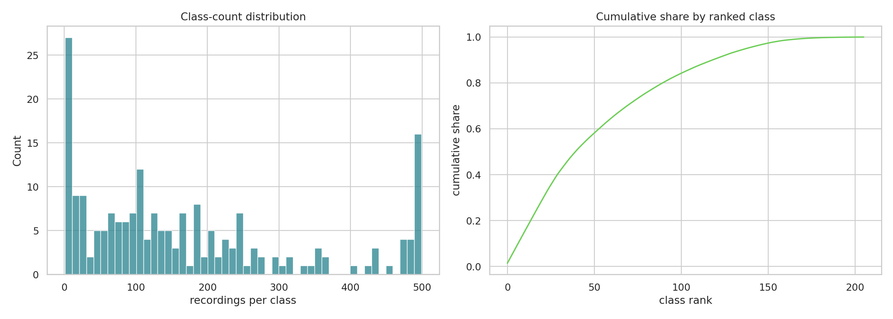
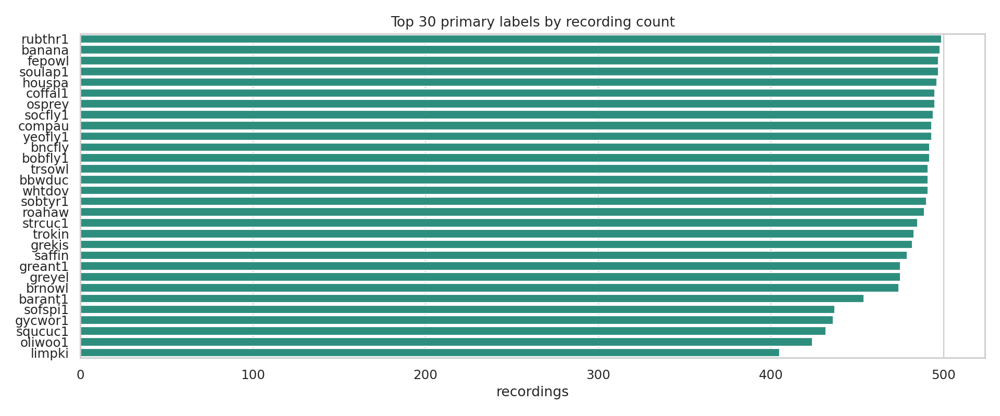
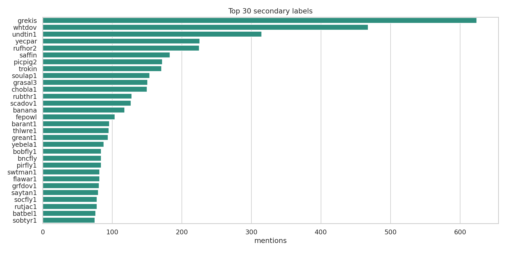

# BirdCLEF+ 2026 EDA Insights

## 1. Dataset Snapshot

- Training metadata contains **35,549 recordings** across **206 primary labels**.
- All **35,549** training audio paths were found during the Kaggle EDA run.
- Taxonomy coverage is complete for train labels: **206/206**.
- Taxonomy includes **28 labels not present in train**, so submission columns should be treated as the output contract.
- The public sample submission has only **3 rows**, making it a smoke test rather than a runtime proxy for hidden scoring.

## 2. Data Integrity

- `train.csv`, `taxonomy.csv`, and `sample_submission.csv` have **0 duplicate rows**.
- Training keys are clean: no duplicate `filename`, `filepath`, or `primary_label + filename` rows.
- `train_soundscapes_labels.csv` has **1,478 rows**, but only **739 unique soundscape segments** after deduplication.

Clean clips are structurally safe for baseline training. Soundscape labels should be deduplicated before prevalence, overlap, or calibration analysis.

## 3. Class Imbalance

- Median recordings per class: **125**.
- Range: **1** to **499** recordings per class.
- Top **10** labels account for **13.9%** of recordings.
- Top **30** labels account for **40.3%** of recordings.
- There are **4 singleton classes**.
- A few-shot bucket view is now included in the EDA notebook to separate near-singleton labels from the broader mid-frequency tail.

| Rank | Primary label | Recordings |
|---:|---|---:|
| 1 | `rubthr1` | 499 |
| 2 | `banana` | 498 |
| 3 | `fepowl` | 497 |
| 4 | `soulap1` | 497 |
| 5 | `houspa` | 496 |

The main imbalance risk is the gap between capped head classes and rare tail classes. Per-class validation metrics, class-aware sampling, and rare-class augmentation should come before larger backbones.

## 4. Secondary Labels

- **161** distinct secondary labels.
- **7,431** total secondary mentions.
- Most frequent labels: `grekis` (**624**), `whtdov` (**468**), `undtin1` (**315**), `yecpar` (**226**), and `rufhor2` (**225**).

The EfficientNet baseline stays single-label for clarity. Secondary labels are better suited for later soft targets, mixup labels, co-occurrence priors, and confusion analysis.

## 5. Metadata Quality And Geography

- **12,849** recordings have rating `0.0`.
- Ratings `4.0` and `5.0` together cover **14,863** recordings.
- Aves dominate with **34,799** recordings and median rating **3.5**.
- Smaller groups such as Amphibia, Mammalia, Insecta, and Reptilia are more likely to carry class and quality shift together.
- Collections split between **XC: 23,043** and **iNat: 12,506**.
- The most common license, `by-nc-sa`, accounts for **22,843** recordings.
- The `type` field is empty for **12,975** rows.
- The top author contributes **2,874** recordings.

All training rows include coordinates. Only **847 recordings** (**2.38%**) fall inside the rough Pantanal box used in this EDA, covering **119 species**. Geography is therefore a likely domain-shift variable, not a balanced training axis.

## 6. Soundscape Domain

After deduplication, the soundscape table has **739** unique labeled segments.

- Mean labels per segment: **4.22**.
- Median labels per segment: **4**.
- 75th percentile: **5** labels.
- 90th percentile: **7** labels.
- Maximum: **10** labels.

Labeled soundscape segments cluster around evening and night hours, especially **20:00-23:00**. This supports hour-aware diagnostics and threshold calibration.

The EDA notebook now also checks:

- Soundscape species coverage versus clean `train_audio` species coverage.
- Soundscape-only labels that may not have clean training examples.
- Site/hour coverage concentration.
- Fully labeled 12-window files versus partially labeled files.
- Mean labels per segment by site and hour.
- Taxonomic activity by hour.
- Top soundscape species pairs and repeated chorus structure.

These views matter because the labeled soundscape subset is not a uniform validation set. It can be used for calibration and domain diagnostics, but site concentration, partial annotation, and source coverage gaps should be accounted for before fitting priors or thresholds.

## 7. Spectrogram Observations

- Some classes show repeated phrase structure throughout a 5-second crop.
- Sparse calls can be missed by random crops.
- Several examples contain strong low-frequency background energy.
- Vocal energy spans different frequency bands, supporting mel CNNs, frequency masking, and multi-crop inference.

## 8. Modeling Takeaways

1. Keep EfficientNet-B0 as the dependable submission baseline.
2. Deduplicate soundscape labels before using them for diagnostics.
3. Track per-class metrics early; aggregate validation can hide rare-class failures.
4. Treat source, author, rating, and geography as potential validation confounders.
5. Use secondary labels after the single-label baseline is stable.
6. Use Perch v2 as a teacher or feature source unless hidden-test inference is proven fast enough.
7. Prioritize multi-crop inference and soundscape-aware calibration before scaling model size.
8. Add hour-aware thresholds or logit offsets only after checking site/hour coverage and soundscape co-occurrence structure.
