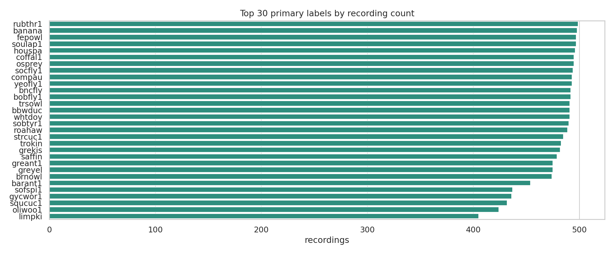
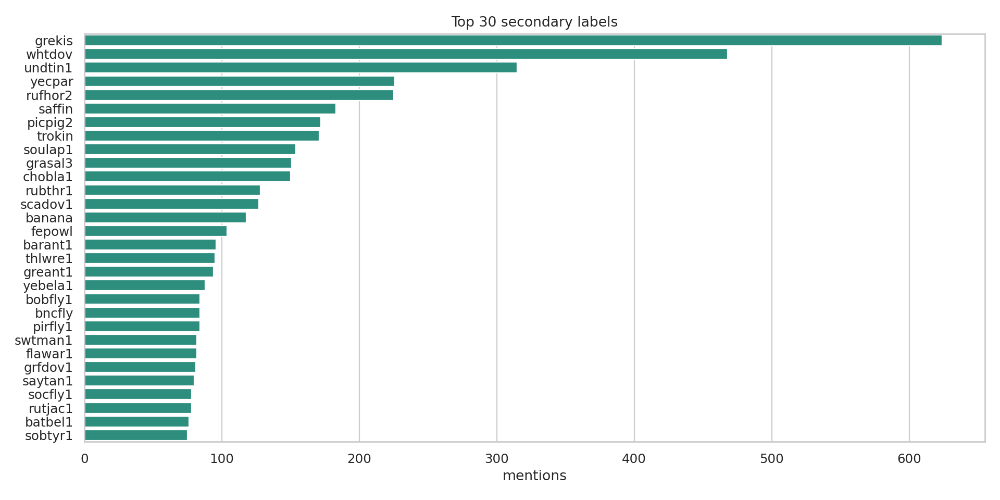
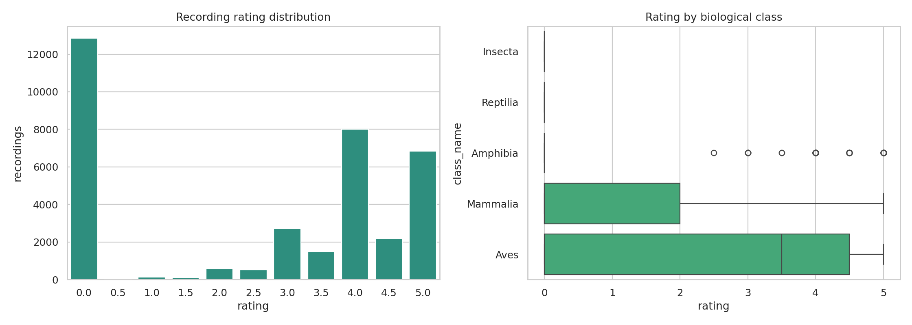
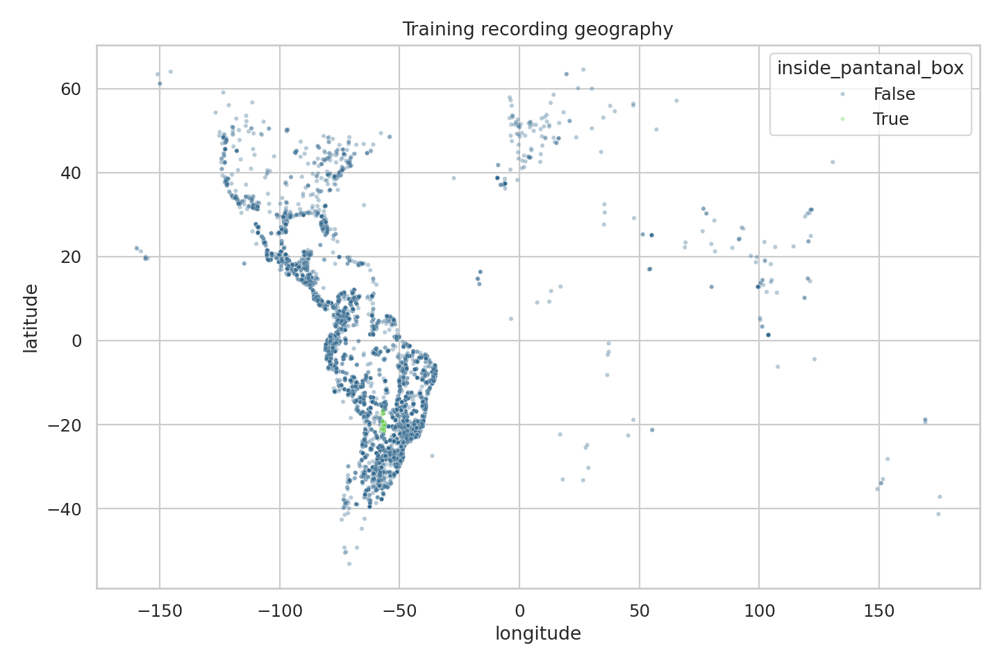
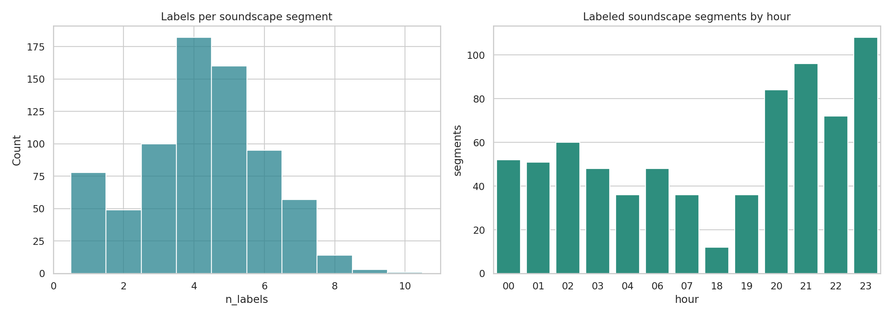
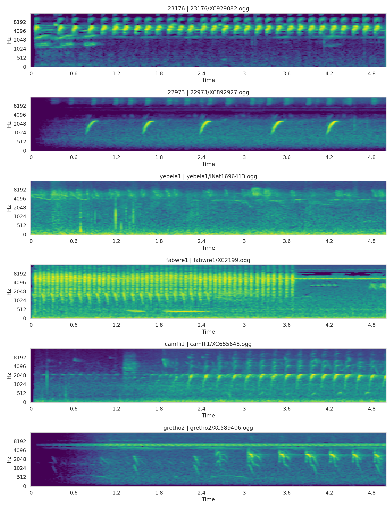

# BirdCLEF+ 2026 EDA Insights

These artifacts were generated by `notebooks/01_data_eda.ipynb` on Kaggle and saved here as a lightweight report snapshot. The raw competition audio and large model outputs remain excluded from Git.

## 1. Dataset Snapshot

- Training metadata contains **35,549 recordings** across **206 primary labels**.
- All **35,549 audio paths were found** during the Kaggle run; `missing_audio_files.csv` only contains the header.
- Taxonomy coverage is complete for train: **206/206 training labels** are present in taxonomy. The taxonomy file also contains **28 labels not present in train**.
- The public sample submission has only **3 rows**, so public notebook success is mainly a smoke test. Hidden scoring may have a much larger file set.

## 2. Data Integrity

- `train.csv`, `taxonomy.csv`, and `sample_submission.csv` have **0 duplicate rows**.
- Training key checks are clean: no duplicate `filename`, `filepath`, or `primary_label + filename` rows.
- `train_soundscapes_labels.csv` has **1,478 rows**, but deduplicates to **739 unique soundscape segments**.
- Every soundscape row participates in duplicate groups by `filename` and `filename + primary_label`, so soundscape analysis should use the deduplicated table for prevalence and overlap summaries.

This is the most important cleaning note from the new artifacts: clean training clips look structurally safe, while soundscape labels need deduplication before they are interpreted.

## 3. Class Imbalance

- Median recordings per class: **125**.
- Range: **1** to **499** recordings per class.
- The top **10** labels account for **13.9%** of all training recordings.
- The top **30** labels account for **40.3%** of all training recordings.
- There are **4 singleton classes**.

The head classes are close to the apparent cap around 500 recordings:

| Rank | Primary label | Recordings |
|---:|---|---:|
| 1 | `rubthr1` | 499 |
| 2 | `banana` | 498 |
| 3 | `fepowl` | 497 |
| 4 | `soulap1` | 497 |
| 5 | `houspa` | 496 |

The risk is less about one dominant class and more about the gap between capped head classes and the long tail. Class-aware sampling, rare-class augmentation, and per-class validation metrics should come before larger backbones.

## 4. Secondary Labels

Secondary labels create a useful but noisy multi-label signal:

- **161** distinct secondary labels appear.
- Total secondary mentions: **7,431**.
- Most frequent secondary labels: `grekis` (**624**), `whtdov` (**468**), `undtin1` (**315**), `yecpar` (**226**), and `rufhor2` (**225**).

For the current EfficientNet baseline, a single-label target is still the cleanest first submission path. Later iterations can use secondary labels for soft targets, mixup targets, co-occurrence priors, or post-hoc confusion analysis.

## 5. Metadata Quality And Geography

Rating is not uniformly distributed:

- **12,849** recordings have rating `0.0`.
- High-quality ratings are still common: `4.0` has **8,018** recordings and `5.0` has **6,845**.
- Aves dominate the dataset with **34,799** recordings and median rating **3.5**.
- Amphibia, Mammalia, Insecta, and Reptilia are much smaller and skew lower in rating, so non-bird classes may carry both class and quality/domain shift.

Source fields also matter:

- Collections are split between **XC: 23,043** and **iNat: 12,506**.
- The most common license is `by-nc-sa` with **22,843** recordings.
- The `type` field is missing or empty for **12,975** rows, while `song` and `call` dominate labeled call types.
- Author distribution is concentrated; the top author has **2,874** recordings.

All training rows include coordinates. Only **847 recordings** (**2.38%**) fall inside the rough Pantanal box used in this EDA, covering **119 species**. That makes geography a likely domain-shift variable rather than a balanced training axis.

## 6. Soundscape Domain

After deduplication, the soundscape table has **739** unique labeled segments. The labels are genuinely multi-label:

- Mean labels per segment: **4.22**.
- Median labels per segment: **4**.
- 75th percentile: **5** labels.
- 90th percentile: **7** labels.
- Maximum: **10** labels.

The labeled hours are not uniform. Segments cluster most strongly around evening/night hours, especially **20:00-23:00**, with hour `23` containing **108** segments. This supports hour-aware validation diagnostics and threshold calibration.

## 7. Spectrogram Observations

The sampled spectrograms show several patterns that matter for modeling:

- Some classes have repeated phrase structure throughout a 5-second crop.
- Some calls are sparse and localized, so random crops can miss vocal activity.
- Several examples show strong low-frequency background energy or broad-band environmental texture.
- Vocal energy spans different frequency bands, which supports mel CNNs but also argues for frequency masking and multi-crop inference.

## 8. Practical Modeling Takeaways

1. Keep EfficientNet-B0 as the dependable competition-safe baseline.
2. Deduplicate soundscape labels before using them for diagnostics.
3. Use grouped or stratified validation that respects class imbalance, source concentration, and geography.
4. Track per-class metrics early; headline validation can hide rare-class failures.
5. Treat Perch v2 as an offline feature generator or teacher unless hidden-test inference is proven fast enough.
6. Use soundscape overlap/hour patterns for calibration and validation design, not as direct clean-clip replacements.

## 9. Artifact Index

Key generated files:

- `dataset_summary.csv`
- `duplicate_summary.csv`
- `key_duplicate_summary.csv`
- `train_schema_missingness.csv`
- `primary_label_counts.csv`
- `secondary_label_counts.csv`
- `primary_secondary_cooccurrence.csv`
- `rating_counts.csv`
- `quality_by_class.csv`
- `geography_summary.csv`
- `soundscape_overlap_summary.csv`
- `soundscape_hour_counts.csv`
- `taxonomy_coverage.csv`
- `modeling_takeaways.csv`
- `class_imbalance_diagnostics.png`
- `top_primary_labels.png`
- `top_secondary_labels.png`
- `metadata_quality_rating.png`
- `recording_geography.png`
- `soundscape_overlap_time.png`
- `representative_mels.png`
